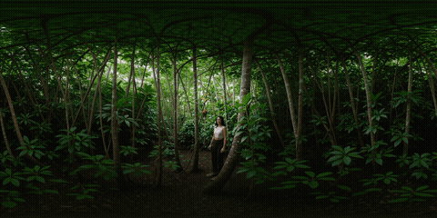
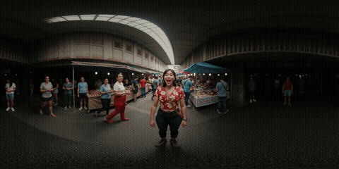
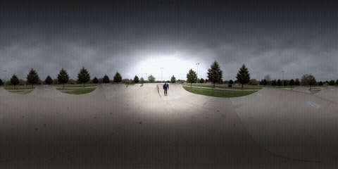

# ComfyUI-VR-Outpaint-Tools

ComfyUI custom nodes for working with 360° equirectangular (ERP) imagery and
video. Built primarily for the **LTX2.3 VR-Outpaint** model; may work with
other ERP-aware diffusion / video models too.

1. **Estimate Camera (GeoCalib)** — auto-estimate the FOV and horizon
   orientation (pitch / roll) of a clip from its first frame, so you don't have
   to know your footage's field of view.
2. **Rectilinear → Equirect** — forward gnomonic projection for outpainting a
   normal perspective shot into a full 360° panorama.
3. **Source Composite (360 outpaint finish)** — after generation, put the real
   source pixels back over the model's reconstruction and correct the
   outpaint's tone drift. The generated panorama keeps the original footage's
   full quality where the source is known.

**Try it / see it live:** [360° gallery + interactive viewer](https://huggingface.co/spaces/TheBurgstall/360viewer) — sample outpaints below, drag to look around.

## Examples

Three flat videos outpainted into full 360° panoramas with the pipeline
above (projection → IC-LoRA outpaint → Source Composite finishing). Click a
clip to open it in the interactive viewer. More clips, including the
text-to-video side of the project, are in the
[full gallery](https://huggingface.co/spaces/TheBurgstall/360viewer/blob/main/gallery.html).

| | | |
|---|---|---|
| [](https://theburgstall-360viewer.hf.space/index.html?url=https%3A%2F%2Fhuggingface.co%2Fspaces%2FTheBurgstall%2F360viewer%2Fresolve%2Fmain%2Fmedia%2Foutpaint-jungle-clearing.mp4) | [](https://theburgstall-360viewer.hf.space/index.html?url=https%3A%2F%2Fhuggingface.co%2Fspaces%2FTheBurgstall%2F360viewer%2Fresolve%2Fmain%2Fmedia%2Foutpaint-market-hall.mp4) | [](https://theburgstall-360viewer.hf.space/index.html?url=https%3A%2F%2Fhuggingface.co%2Fspaces%2FTheBurgstall%2F360viewer%2Fresolve%2Fmain%2Fmedia%2Foutpaint-skatepark.mp4) |
| Jungle clearing | Covered market hall | Skatepark run |

The example workflow used for these:
[`example_workflows/Burgstall-SEAMLESS-VR-Outpaint.json`](example_workflows/Burgstall-SEAMLESS-VR-Outpaint.json).

## Related Burgstall Labs Work

- **[360° gallery + viewer](https://huggingface.co/spaces/TheBurgstall/360viewer)** — sample generations from this pack and from Seamless-Equirectangular, viewable interactively; both example workflows are downloadable there too.
- **[ComfyUI-Seamless-Equirectangular](https://github.com/Burgstall-labs/ComfyUI-Seamless-Equirectangular)** — seamless text-to-video 360° generation (no source footage) with the same equirectangular LoRA, seam, and pole techniques.
- **[ComfyUI-Domemaster-Outpaint](https://github.com/Burgstall-labs/ComfyUI-Domemaster-Outpaint)** — companion pack for fulldome / planetarium delivery of the outpainted panorama (domemaster rendering with tilted-venue presets, square-hemisphere workflow).
- **[Seamless-Equirectangular-LTX2.3-LoRA](https://huggingface.co/TheBurgstall/Seamless-Equirectangular-LTX2.3-LoRA)** — the LoRA the outpaint IC-LoRA pipeline is built around.

## Install

```bash
cd ComfyUI/custom_nodes
git clone https://github.com/Burgstall-labs/ComfyUI-VR-Outpaint-Tools
cd ComfyUI-VR-Outpaint-Tools
pip install -r requirements.txt
```

Restart ComfyUI. Nodes appear under the `360/projection` category.

`scipy` is optional — it's used for a fast Euclidean distance transform in the
`bounding_rect` fill path of `Rectilinear → Equirect`. Without it the pack
falls back to a slower pure-PyTorch dilation.

[`geocalib`](https://github.com/cvg/GeoCalib) is only needed for the
**Estimate Camera (GeoCalib)** node and is installed from git (not on PyPI):

```bash
pip install git+https://github.com/cvg/GeoCalib
```

The node lazy-imports it and prints an install hint if it's missing — every
other node works without it.

## Auto-prep workflow

The estimator removes the guesswork: point it at your clip, wire its outputs
into the prep node, and the projection is driven by the inferred camera.

```
[Load Video] ─┬─────────────────────────────► [Rectilinear → Equirect] ─► (equirect, mask)
              │                                   ▲  ▲  ▲  ▲
              └─► [Estimate Camera (GeoCalib)] ───┘  │  │  │
                     hfov_deg / focal_px ────────────┘  │  │
                     pitch_deg ──────────────────────────┘  │
                     roll_deg ──────────────────────────────┘
```

The prep node's `image` input stays the **original video** — it strips its own
letterbox and projects every frame. The estimator only reads the first frame for
calibration. (Prefer wiring `focal_px` over `hfov_deg`: it's crop-invariant.)

## Nodes

### Estimate Camera (GeoCalib)

Runs single-image camera calibration ([GeoCalib](https://github.com/cvg/GeoCalib))
on one frame of an image / video batch and reports the field of view and horizon
orientation.

Estimation runs on the **full frame** by default. GeoCalib reads the whole
field's perspective cues, so cropping the frame *before* estimating throws the
result off — e.g. a dark sky gets mistaken for a letterbox bar, the frame shrinks,
and the estimated focal length inflates (your ~70° clip reads as ~38°). Letterbox
removal for the actual projection happens in the **prep node**, where it belongs.

| Input | Description |
|---|---|
| `image` | Source `IMAGE` (or IMAGE batch = video); only one frame is used |
| `frame_index` | Which frame to calibrate on (default `0`; pick a mid-clip frame if the clip fades in from black) |
| `weights` | GeoCalib weights: `pinhole` (default) or `distorted` (wide / fisheye) |
| `camera_model` | `pinhole` · `simple_radial` · `simple_divisional` |
| `strip_letterbox` | Crop bars before estimating (default **off**) — only enable for sources with hard baked-in black bars; GeoCalib tolerates mild bars, so prefer off |
| `letterbox_threshold` | Brightness threshold used when `strip_letterbox` is on |

Outputs `(hfov_deg, vfov_deg, pitch_deg, roll_deg, focal_px, first_frame)`:

- `hfov_deg` / `vfov_deg` — horizontal / vertical field of view, degrees.
- `pitch_deg` / `roll_deg` — horizon orientation; wire into the prep node to
  auto-level. (Sign conventions may differ by source — flip if the horizon tilts
  the wrong way.)
- `focal_px` — horizontal focal length in pixels (the camera intrinsic). The most
  robust value to feed the prep node's `focal_px`: it stays valid when the prep
  node strips letterbox for the projection.
- `first_frame` — the frame used (preview / debug; the prep node does **not**
  need it).

### Rectilinear → Equirect (360 outpaint prep)

Projects a perspective image / video onto a 2:1 equirectangular canvas at a
chosen `(yaw, pitch)`, producing the distorted / padded ERP image plus an
outpaint mask marking the region the model should generate.

| Input | Description |
|---|---|
| `image` | Source rectilinear `IMAGE` (or IMAGE batch = video) |
| `hfov_deg` | Horizontal field-of-view of the source frame, degrees (ignored when `focal_px > 0`) |
| `fov_scale` | Multiplier on the resolved FOV (default `1.0`). `> 1` spreads the footprint wider than the true FOV — see *Detail vs geometry* below |
| `equirect_width` / `equirect_height` | Output canvas size (2:1 recommended) |
| `yaw_deg` / `pitch_deg` / `roll_deg` | Where to place the view on the sphere; `roll_deg` levels a tilted horizon |
| `shape` | `pincushion` (curved footprint) · `inscribed_rect` (largest axis-aligned rect fully inside) · `bounding_rect` (fill bbox, extrapolating corner gaps from nearest projected pixels) |
| `fill_value` | Scalar `[0,1]` for outside-content pixels |
| `feather_px` | Soft-edge the content/mask boundary |
| `strip_letterbox` / `letterbox_threshold` | Auto-crop black bars before projection |
| `focal_px` *(optional)* | Focal length in pixels; when `> 0` it overrides `hfov_deg`. Wire from **Estimate Camera (GeoCalib)** — crop-invariant, so it stays correct through letterbox stripping |
| `canvas_hfov_deg` / `canvas_vfov_deg` *(optional)* | Angular span of the output canvas (default `360` / `180` = full equirect). `180` / `180` on a square canvas = **square hemisphere** (covers exactly one dome — see ComfyUI-Domemaster-Outpaint) |

Outputs `(equirect_image, outpaint_mask)`.

The node preserves the input's **native (de-letterboxed) aspect ratio** — there
is no forced aspect crop — so it works across the full AR/FOV palette of the
LTX2.3 VR-Outpaint model (aspect ~1.33–2.39, FOV ~70–130°). Either type the FOV
into `hfov_deg`, or wire `focal_px` / `hfov_deg` / `pitch_deg` / `roll_deg` from
the **Estimate Camera (GeoCalib)** node to drive the projection automatically.

#### Detail vs geometry (`fov_scale`)

A view only covers `hfov/360` of the panorama's width, so a narrow/telephoto
source (e.g. a true 38° lens) lands as a small patch — preserving its detail then
needs a huge canvas. `fov_scale` is the escape hatch: it multiplies the resolved
FOV so the footprint is spread wider than reality.

| `fov_scale` on a 38° source | projected FOV | area on 360° | look |
|---|---|---|---|
| `1.0` | 38° (true) | ~1.3% | exact geometry, tiny patch |
| `1.85` | ~70° | ~4.6% | mild stretch — matches the model's narrow training FOV |
| `2.4` | ~90° | ~8% | more area, visible perspective exaggeration |

`> 1` trades exact angular scale for area/detail. Because the model's reference
crops were trained at **70–130°**, a true sub-70° source is out of distribution
anyway — scaling it up to ~70° is both more detail-preserving *and* more in-domain.
Tune per clip; the estimator always reports the true measured FOV.

### Source Composite (360 outpaint finish)

Finishing pass for the outpaint. The diffusion model only *reconstructs* the
source region (VAE round-trip + generation), which softens its edges — and
generated content drifts darker/off-tone the farther it gets from the guide.
This node fixes both in pixel space, after the final decode:

1. **Tone match** — fits one per-channel gain + offset where generation and
   truth overlap (the source region) and applies it to the whole frame.
   Corrects any global reconstruction tone shift. Fitted batch-wide, so it is
   temporally stable.
2. **Tone equalize** — corrects the *distance-dependent* drift: reads each
   latitude band's low-frequency tone at the patch longitude (where tone is
   trusted), extends that reference around the full 360°, and gain-corrects
   each column toward it (clamped ×0.5–2.0). Preserves vertical lighting
   structure (bright sky / dark ground) and color; one correction field for
   the whole clip, so no flicker.
3. **Composite** — pastes the pristine source pixels over the reconstruction
   with a feathered, wrap-aware mask that ramps inward from the boundary
   (never samples fill/black). Original sharpness and fidelity wherever the
   source is known.

| Input | Description |
|---|---|
| `generated` | The outpainted equirect video (final VAE decode) |
| `source_equirect` / `outpaint_mask` | The same two outputs of **Rectilinear → Equirect** that fed the sampler |
| `tone_match` | Strength of the global tone correction (default `1.0`) |
| `feather_px` | Composite boundary feather, pixels (default `12`) |
| `tone_equalize` | Strength of the longitudinal drift correction (default `0.7`). Lower it for scenes with strong legitimate directional lighting (sun on one side); raise to `1.0` for maximum flattening |
| `wrap_w` *(optional)* | Treat the canvas as wrapping horizontally (default on). Disable for partial canvases like the square hemisphere |

Outputs the composited `IMAGE` batch.

## Notes

- All nodes operate on ComfyUI's standard `(B, H, W, C)` IMAGE tensors,
  `float` in `[0, 1]`, and preserve batch dimension (works on video IMAGE
  batches).
- `Rectilinear → Equirect` uses `F.grid_sample` with bilinear filtering and
  runs on the same device as the input tensor.

## License

This nodepack is licensed under the **PolyForm Noncommercial License 1.0.0**
(https://polyformproject.org/licenses/noncommercial/1.0.0). Noncommercial use
(research, academic, personal, hobbyist) is free. Commercial use requires a
separate license — contact **howdy@theaiwrangler.com**. See the LICENSE file
for details.
